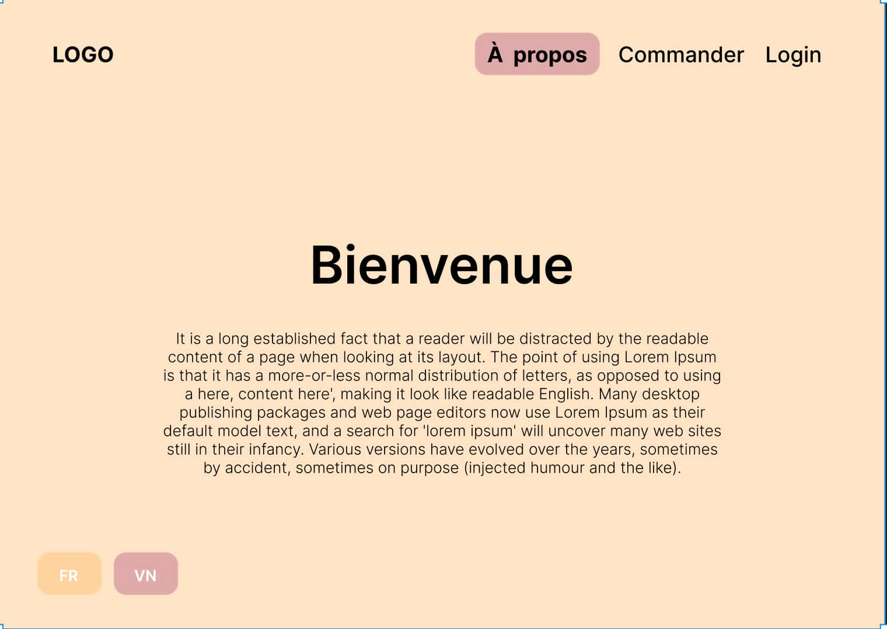
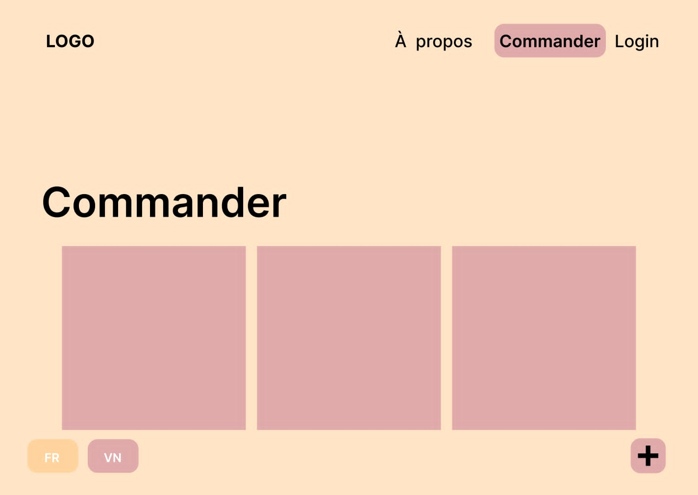

## Maquette

## Point de terminaison d'Api
Users
* POST /register : La création d'un nouveau compte
* POST /login : Vérification de l'utilisateur

Avis(Reviews)
* GET / : Récupération tous les avis
* GET /:aid : Récupération des détails d'un avis
* POST / : Permet à l'utilisateur de créer un nouvel avis
* DELETE : Permet à l'utilisateur de supprimer leur avis

## Page Front end
Page Publiques
* Page d'accueil : Présente le site
* Page de commande : Page pour commander
* Page d'avis : Page où se situe tous les avis(reviews) des clients
* Bouton de déconnection

Page Protégées
* Page Ajouter un Avis : Ajouter un nouveau avis
* Page Modifier : Modification d'un avis de l'utilisateur

